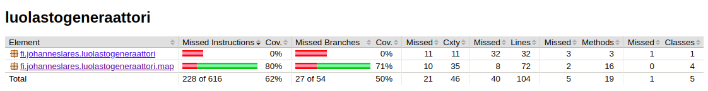
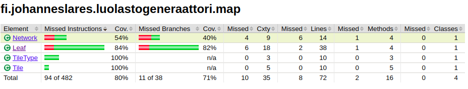
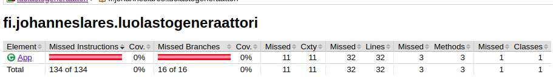

# Testausdokumentaatio

Projektin testaaminen tapahtuu JUnit 4 testeillä ja testikattavuus todetaan Jacocon avulla (Maven plugin)

### Map -testaus 

map-packagen testaus on suoritettu jokaiselle tämän hetken luokalle.

### Muiden testaus

Muille asioille ei ole testejä kirjoitettu

